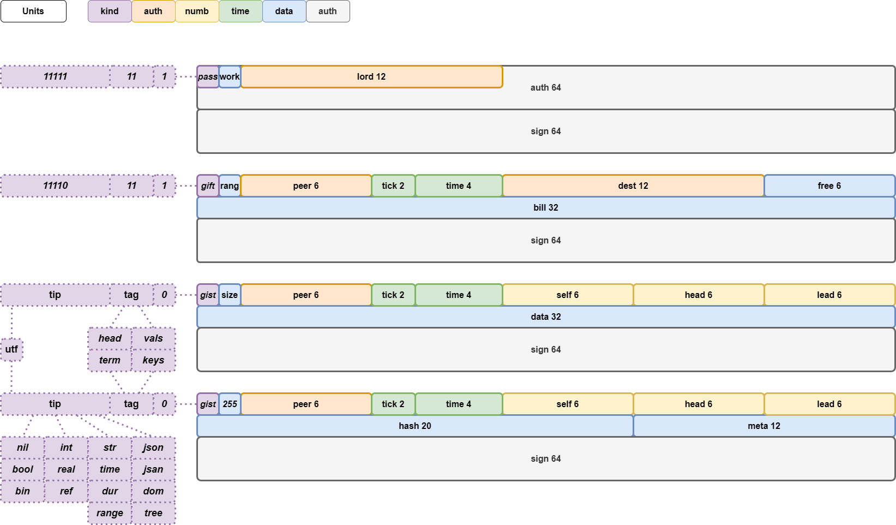
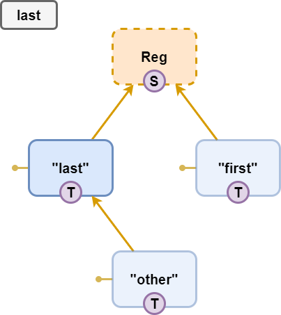
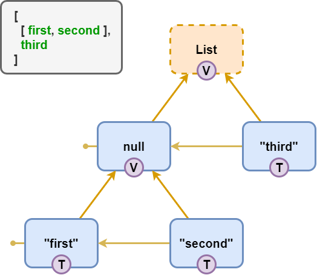
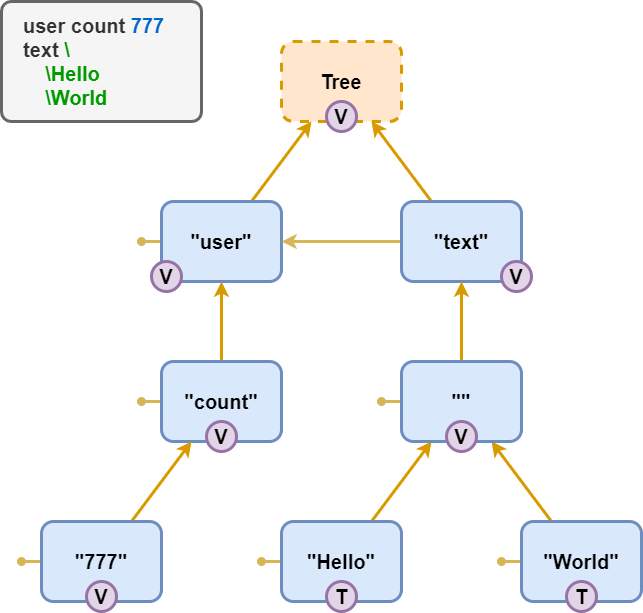
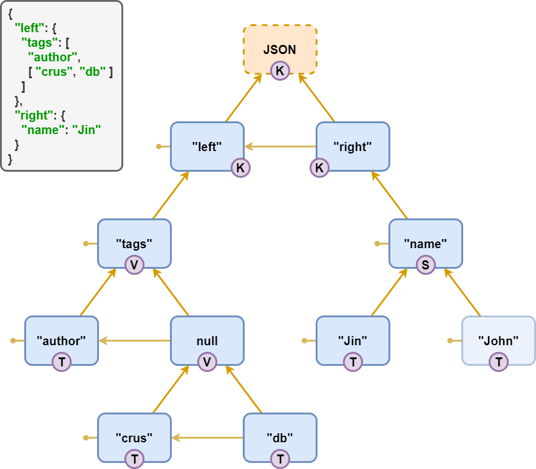

# CRUS🦿DB

> *💃 The elegant basis for reactive architecture.*

- **C**onvergent: *CvRDT, Total Ordered, Interleaving Free, Weak Typed*
- **R**ealtime: *Delta Replication, WebSocket/WebRTC, Inplace Updates, In Memory with Persistance*
- **U**nbreakable: *High availability, Partition Tolerance, Auto Recovery, Long Offline, WAL Free, Backup Free*
- **S**ecure: *Private Key Auth, Signed Changes, Encrypted Merge, Zero-Trust, Leakage Proof*
- **D**ecentralized: *Local First, Oracle Free, Peer to Peer*
- **B**rilliant: *Reactive Architecture, Graph Structure, First Class ISO8601/JSON/DOM/Tree*

## Features

### 🔆 Convergent

Изменения от всех пиров неизбежно объединяются в единое для всех состояние мира.

#### CvRDT

Объединение изменений происходит без конфликтов благодаря хранениию в виде бесконфликтных типов данных.

#### Total Ordered

Все данные в базе упорядочены, что даёт предсказуемый и стабильный порядок их обработки.

#### Interleaving Free

Одновремено внесённые в одно и то же место последователности не меремешиваются, а выстраиваются друг за другом.

#### Weak Typed

Возможность динамического изменения типа данных, без потери возможности слияния изменений, внесённых в разные типы.

### 💨 Realtime

Внесённые данные в реалном времени распространяются между всеми заинтересованными в них пирами.

#### Delta Replication

При синхронизации каждый пир пересылает другим пирам только недостающие им данные.

#### WebSocket/WebRTC

Двусторонняя единообразная коммуникация между всеми пирами, будь то сервера или клиенты.

#### Inplace Updates

Все юниты данных имеют одинаковый неольшой размер, что позволяет их обновлять атомарно на месте, без перемещения.

#### In Memory with Persistance

Данные хранятся в памяти, что позволяет не практически зависеть от дисковых задержек. При этом сброс в постоянное хранилище происходит в фоне.

### 💪 Unbreakable

Архитектура эффективно сопротивляется болшинству технических неполадок.

#### High availability

Благодаря локальности база данных полностью функциональна и имеет стабильное время отклика независимо от состояния сети и других узлов.

#### Partition Tolerance

Пиринговая сеть может быть разделена на произвольное число независимо работающих подсетей, которые без проблем продоолжают совместную работу при восстановлении связности.

#### Auto Recovery

Повреждённые или подложные данные детектируются и удаляются, а с других пиров затягиваются недостающие данные.

#### Long Offline

Даже после долгого оффлайна внесённые изменениия интегрируются в общую базу данных без пролем.

#### WAL Free

Так как запись происходит атомарно, то не требуется дублирование записи в иммутабельный лог на случай сбоя.

#### Backup Free

Бэкапы не требуются, так как даные легко могут быть восстановлены с других узлов сети. В том числе сервер может восстановить данные с клиентских устройств.

### 🔐 Secure

Максимальный уровень безопасности обеспечивается криптографией.

#### Private Key Auth

Аутентификация обеспечивается приватным ключом, который не передаётся другим узлам.

#### Signed Changes

Все изменения подписываются приватным ключом автора. Все узлы, при получении данных, проверяют цифровую подпись и права.

#### Encrypted Merge

Приватные данные хранятся в зашифрованном виде, что не мешает любому узлу без дешифровки осуществлять слияние авторизованных изменений.

#### Zero Trust

Все гарантии обеспечиваются алгоритмически на каждом узле. Каждый узел не доверяет никакому другому. Даже себе, ибо производит проверку даже данных, полученных с локального диска.

#### Leakage Proof

Утечка всей базы данных не приводит к раскрытиию приватных данных, так как они хранятся в зашифрованном виде. Зашифрованный секретный ключ передаётся вместе с остальными правами от одного пира другому.

### 💱 Decentralized

Все пиры равноправны, что защищает от падения или компрометации любого узла сети.

#### Local First

Все данные читаются/сохраняются локално, а потом в фоне синхронзируются с другими пирами.

#### Oracle Free

Упорядоченност состояния гарантируется алгоритмически, что не требует выделенного доверенного узла для достижения консенсуса.

#### Peer to Peer

Все узлы, работающие с базой данных, образуют связную одноранговую сеть. Любой сервер - такой же клиент базы данных, как и все остальные узлы.

### 💎 Brilliant

Элегантная крайне простая архитертура даёт при этом высокую гибкость и надёжность.

#### Reactive Architecture

Вместо удалённых вызовов и распространения событий, тут есть только работа с локальной копией БД, реакции на её текущее состояние, и фоновая синхронизация её между пирами. Состоение базы полностью определяет поведение, что позволяет спокойно перезапускать любые задачи в любой момент.

#### Graph Structure

Все данные актуально хранятся в рёбрах глобального графа, которые сгруппированы в кластеры, каждый из которых имеет свой набор разрешений и синхронзируется лениво-атомарно.

#### First Class ISO8601/JSON/DOM/Tree

Популярные модели данных являются частными случаями используемой в базе данных.

## TypeScript API

### Entity Models

```ts
/** Organ Model */
export class $my_organ extends $hyoo_crus_entity.with({
	// Title: $hyoo_crus_reg_str, - inherited from $hyoo_crus_entity
	Critical: $hyoo_crus_reg_bool, // atomic boolean
	Count: $hyoo_crus_reg_int, // atomic big integer
	Weight: $hyoo_crus_reg_real, // atomic double size float
	Photo: $hyoo_crus_reg_bin, // atoic blob
	Description: $hyoo_crus_text, // mergeable long text
	Contains: $hyoo_crus_list.ref( ()=> $my_organ ), // reference to same Model
}) {}

/** Person Model */
export class $my_person extends $hyoo_crus_entity.with({
	// Title: $hyoo_crus_reg_str, - inherited from $hyoo_crus_entity
	Sex: $hyoo_crus_reg_str, // atomic short string
	Birthday: $hyoo_crus_reg_time, // atomic time moment
	Heart: $my_organ, // embedded Model
	Parent: $hyoo_crus_reg.ref( ()=> $my_person ), // reference to Model
	Kids: $hyoo_crus_list.ref( ()=> $my_person ), // list of references to Models
	/** @deprecated Use Parent */ Father: $hyoo_crus_reg.ref( ()=> $my_person ),
}) {
	
	// Override default implementation
	// Workaround for https://github.com/microsoft/TypeScript/issues/27689
	get sex() {
		return ( next?: string )=> super.sex( next ) ?? 'male'
	}
	
	// Fallack to old field
	get parent() {
		return ( next?: $my_person | null )=> super.parent( next ) ?? super.father()
	}
	
}
```

### Realm Usage

```ts
/** Application, component etc */
export class $my_app extends $mol_object {

	// Whole database
	@ $mol_mem
	Realm() {
		return new $hyoo_crus_realm
	}
	
	// Current user profile for current application
	@ $mol_mem
	Profile() {
		return this.Realm().home().Profile( '$my_app', $my_person )
	}
	
	// Use existed entity by reference
	@ $mol_mem_key
	Person( ref: string ) {
		return this.Realm().Node( ref, $my_person )
	}
	
	// Add new linked entity
	@ $mol_action
	kid_add( name: string ) {
		
		const me = this.Profile()
		
		// Populate external entity
		const kid = me.Kids.remote_make()
		kid.parent( me )
		
		// Fill self fields
		kid.title( name )
		kid.birthday( new $mol_time_moment( '1984-08-04' ) )
		
		// Fill embedded entities
		const heart = kid.Heart
		heart.critical( true )
		heart.count( 1n )
		heart.weight( 1.4 )
		heart.description( 'Pumps blood!' )
		
		return kid
	}
	
}
```

## Types

### Unit

Юнит - минимальный кирпичик состояния. Каждый юнит позиционируется относительно head (по вертикали) и lead (по горизонтали) юнитов и имеет один из четырёх тегов:

- **T**erm - просто содержит данные. Вложенные юниты не предполагаются.
- **V**als - содержит список значений, где каждый вложенный юнит отвечает за элемент списка.
- **S**olo - регистр, хранящий данные в первом вложенном юните.
- **K**eys - содержит список ключей, где каждый вложенный юнит отвечает за элемент списка.



### LWW-Register

Регистр - хранит одно последнее установленное значение. Если базе актуално находится список, то работает с первым элементом этого списка.



### Ordered List

Список значений может работать и как упорядоченное множество при использовании соответствющих методов.



### Ordered Dictionary

Словарь актуально является упорядоченным множеством ключей, внутри каждого из которых хранится произволный CRUS тип данных.


### Tree



### Plain Text

Плоский текст является списком параграфов, каждый из которых хранит список токенов. Является частным случаем DOM.


### DOM


### JSON



## Synchronization Protocol

Сперва два пира обмениваются фейсами (что-то типа "векторных часов"), которые возволяют понять, каких юниитов не хватает партнёру. Далее они докидывают друг другу недостающие юниты по мере их появления. Подтверждение приёма не требуется - полагаемся на транспортный уровен, гарантирующий либо доставку, либо обрыв соединениия с последующим реконнектом, обменом фейсами и тд.


### Pack

Пакет состоит из произволного числа частей разных типов. Пакет может передаваться как сообщениие другому пиру, может сохраняться в файл. И даже СУБД может хранить данные в том же самом формате.


